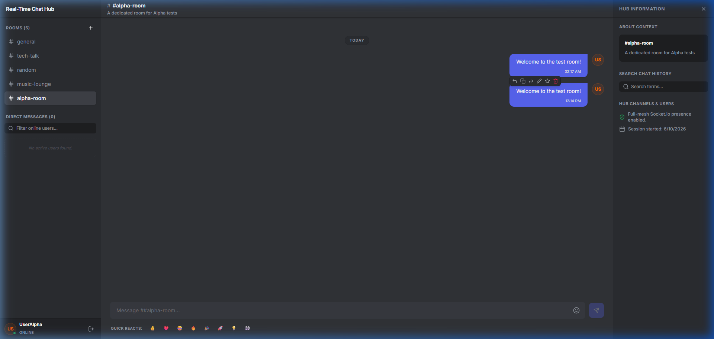
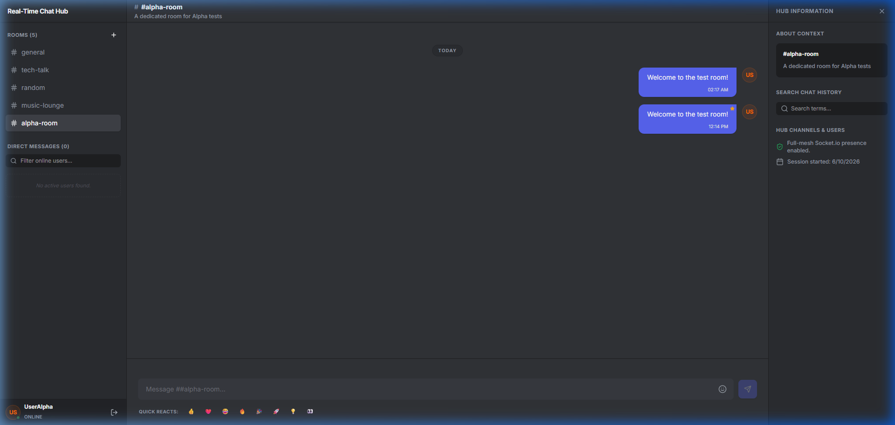
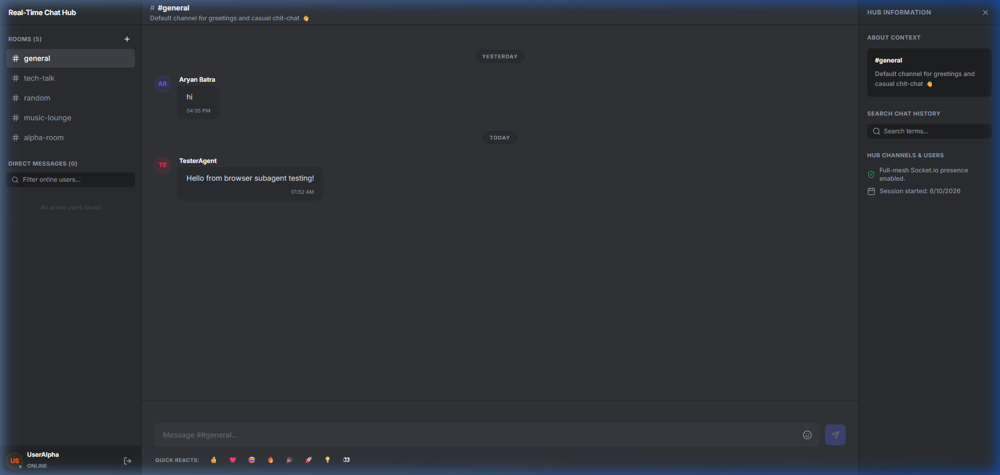

# CollabSpace 💬

A modern, high-performance real-time chat application with a sleek dark theme. This application supports multi-user group chat rooms and private direct messaging, powered by a Node.js + Socket.IO server and Supabase for secure user authentication and message persistence.

---

## Project Overview

CollabSpace provides a premium chat experience similar to Discord or WhatsApp. It is designed to run locally or in production as a full-stack application, where client-side assets are served directly from the Express server. It bridges the gap between stateful real-time WebSockets and persistent database storage by using Supabase to save user profiles and chat history securely, ensuring data is never lost across server restarts or page refreshes.

---

## Frontend Features

- **Auth & Session Gate**: A polished onboarding login and registration screen utilizing smooth 3D mouse tilt cards and custom initial avatars.
- **Online Presence Roster**: A live sidebar listing connected colleagues with active green indicators or "Last seen" timestamps if offline.
- **Direct Messaging**: One-on-one private chats featuring WhatsApp-style delivery checkmarks (single grey tick for sent, double grey ticks for delivered, double blue ticks for read).
- **Group Chats (Rooms)**: Create custom group rooms dynamically. All online users are automatically connected to group rooms at the socket level. Includes a "Read by X" group receipt system with detailed user hover tooltips.
- **Rich Message Actions**: Hovering over any chat bubble displays an action drawer to:
  - **Reply**: Tags a parent message previewing it above the input composer.
  - **Edit**: Inline editor textarea to modify message text in real-time.
  - **Star**: Toggles a gold star status badge.
  - **Forward**: Opens a modal listing rooms and users to duplicate messages to.
  - **Copy**: Copies message contents to clipboard with success indicators.
  - **Delete**: Permanently removes messages from the feed and Supabase database.
- **Message Info**: Direct chat header and bubble info triggers detailed delivery and read timestamps.
- **Responsive Navigation Layout**: Sidebar collapses into a mobile slide-in menu drawer on narrow screens, togglable via a header hamburger button.

---

## Tech Stack

- **Framework**: React 19 (Client) + Node.js Express (Backend Server)
- **Real-Time Layer**: Socket.IO (v4)
- **Database & Auth**: Supabase (PostgreSQL Client SDK)
- **Styling**: Vanilla CSS (TailwindCSS v4 directives used for layout helpers)
- **Animations**: Framer Motion (Motion v12)
- **Icons**: Lucide React
- **Build Tool**: Vite 6 + Esbuild (for server bundling)
- **Language**: TypeScript (v5)

---

## Socket Events Used

### Authentication & Sessions
- `user-register`: Dispatched by client to request new credentials signup.
- `user-login`: Dispatched by client to request profile login authorization.
- `user-init-auth`: Client request to recover sessions with a JWT token, mapping online sockets and sending room histories.
- `user-joined` / `user-left`: Server broadcasts to update active sidebar presence.

### Messaging & Actions
- `send-message`: Transmits message content, IDs, and target parameters (room or user recipient).
- `message-receive`: Server routes incoming direct/group messages to relevant sockets.
- `typing-status` / `typing-status-update`: Broadcasts real-time bouncing dot indicators.
- `mark-as-read` / `messages-read-ack`: Manages WhatsApp-style blue tick state handshakes.
- `edit-message` / `message-edited`: Processes and broadcasts inline content edits.
- `delete-message` / `message-deleted`: Processes and broadcasts message removals.
- `star-message` / `message-starred`: Syncs message gold star decorations.
- `create-room` / `room-created`: Syncs custom channels addition in real-time.

---

## Assumptions Made

1. **Supabase Variables**: A valid Supabase project exists with `profiles` and `messages` tables configured. The endpoint URL and API keys are mapped locally inside a `.env` file.
2. **Room Lifecycles**: Chat rooms are kept in-memory on the server (`rooms` array) while messages sent inside those rooms are stored permanently in Supabase Postgres.
3. **Implicit Joining**: All registered users are implicit members of all room channels, meaning joining a room happens automatically on initialization or when a new room is created.

---

## Screenshots & Demo

### Group Room Creation & Custom Aesthetics


### Gold Star Badges & Real-time Edits


### Message Deletion & Sidebar Sync


---

## Requirements

- Node.js 18+
- npm 9+

---

## Setup Instructions

1. **Clone the Repository**:
   ```bash
   git clone https://github.com/AryanBatra16/real-time-chat-hub
   cd real-time-chat-hub
   ```

2. **Install Dependencies**:
   ```bash
   npm install
   ```

3. **Configure Environment Variables**:
   Create a `.env` file in the root directory:
   ```env
   SUPABASE_URL=https://your-project-id.supabase.co
   SUPABASE_ANON_KEY=your-supabase-anon-key
   ```

4. **Run the Development Server**:
   ```bash
   npm run dev
   ```
   The application will launch on **[http://localhost:3000](http://localhost:3000)**.

---

## Usage Scripts

- **Start dev server**: `npm run dev`
- **Build production assets**: `npm run build`
- **Start production server**: `npm run start`
- **Lint TypeScript checks**: `npm run lint`

---

## File Structure

```
real-time-chat-hub/
├── assets/
│   ├── screenshots/              # Demo screenshots
│   └── files/                    # Requirements documentation
├── dist/                         # Compiled bundle artifacts
├── src/
│   ├── components/
│   │   ├── ChatWindow.tsx        # Main message layout, bubbles, composer, modals
│   │   ├── InfoSidebar.tsx       # Sidebar detailing context and search filters
│   │   ├── LoginScreen.tsx       # Secure landing auth gate
│   │   └── RoomSidebar.tsx       # Channel list, online rosters, and profile cards
│   ├── utils/
│   │   └── formatTime.ts         # Localized date formats
│   ├── types.ts                  # Shared TypeScript interfaces
│   ├── index.css                 # Custom glassmorphic dark theme styling
│   ├── App.tsx                   # Main state controller, routing, and sockets
│   └── main.tsx                  # Client mount entrypoint
├── server.ts                     # Express + Socket.IO orchestration and Supabase client
├── vite.config.ts                # Client bundler configuration
├── package.json                  # Dependencies and run scripts
└── README.md                     # Project documentation
```
